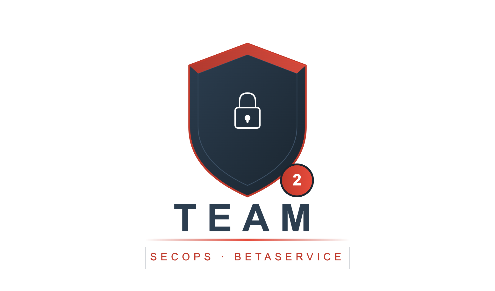
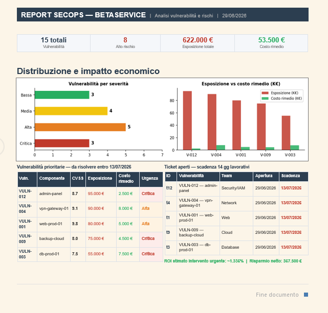

# Report SecOps — BetaService

<p align="center">
  
</p>

## Descrizione del progetto

Questo repository contiene il report esecutivo del progetto **SecOps BetaService**, un'attività didattica di assessment di sicurezza orientata all'analisi delle vulnerabilità, alla valutazione del rischio e alla definizione di un piano di remediation.

L'obiettivo del lavoro è trasformare dati tecnici di sicurezza in un documento comprensibile anche per figure non tecniche, evidenziando priorità, impatto economico, ticket operativi e scadenze di intervento.

## Executive summary

L'assessment di sicurezza condotto sull'infrastruttura di **BetaService** ha individuato **15 vulnerabilità** distribuite tra i principali sistemi aziendali. Di queste, **8 risultano classificate ad alto rischio**.

L'esposizione economica complessiva stimata è pari a circa **622.000 €**, mentre il costo totale degli interventi di remediation è pari a **53.500 €**.

L'analisi ha coinvolto **11 team operativi**, coordinati dal team SecOps, con particolare attenzione ai sistemi esposti a Internet e agli asset che trattano dati sensibili dei clienti.

## Dashboard del report

<p align="center">
  
</p>

## Risultati principali

| Indicatore | Valore |
|---|---:|
| Vulnerabilità totali | 15 |
| Vulnerabilità ad alto rischio | 8 |
| Esposizione economica totale | 622.000 € |
| Costo totale remediation | 53.500 € |
| Vulnerabilità prioritarie | 5 |
| Esposizione vulnerabilità prioritarie | 395.000 € |
| Costo remediation vulnerabilità prioritarie | 27.500 € |
| Risparmio netto stimato | 367.500 € |
| ROI stimato | > 1.300% |

## Vulnerabilità prioritarie

Le cinque vulnerabilità considerate prioritarie dovranno essere risolte entro 14 giorni. Le criticità principali riguardano:

- `admin-panel`
- `vpn-gateway-01`
- `web-prod-01`
- `backup-cloud`
- `db-prod-01`

Queste vulnerabilità rappresentano la parte più rilevante dell'esposizione economica complessiva, con un rischio stimato pari a **395.000 €** e un costo di remediation pari a **27.500 €**.

## Piano di remediation

Le scadenze previste per la gestione delle vulnerabilità sono:

| Categoria | Scadenza |
|---|---|
| Vulnerabilità critiche | 13 luglio 2026 |
| Vulnerabilità ad alto rischio | 20 luglio 2026 |
| Vulnerabilità a medio rischio | 29 luglio 2026 |
| Vulnerabilità a basso rischio | 13 agosto 2026 |

## Vulnerabilità successive da affrontare

Le vulnerabilità non incluse nel piano urgente generano un rischio residuo pari a **227.000 €**, con un costo di bonifica stimato di **26.000 €**.

Tra queste, le più rilevanti per la fase successiva sono:

- `VULN-002`
- `VULN-006`
- `VULN-011`

## Obiettivi didattici

Il progetto consente di esercitarsi su attività tipiche di un contesto SecOps e GRC:

- analisi delle vulnerabilità;
- collegamento tra vulnerabilità e asset aziendali;
- valutazione del rischio;
- stima dell'impatto economico;
- prioritizzazione degli interventi;
- gestione dei ticket;
- definizione delle scadenze operative;
- scrittura di un executive summary;
- comunicazione dei risultati a stakeholder tecnici e non tecnici.

## Tecnologie e strumenti utilizzati

Il lavoro può essere realizzato e documentato con strumenti come:

- Google Sheets o Excel per l'analisi dei dati;
- Google Docs o Word per il report esecutivo;
- PowerPoint o Canva per dashboard e presentazioni;
- GitHub per archiviazione, documentazione e condivisione del progetto.

## Struttura consigliata del repository

```text
.
├── README.md
├── assets/
│   ├── team-logo.png
│   └── secops-dashboard.png
└── docs/
    └── report-secops-betaservice.pdf
```

## Autori

- Federica Della Rocca
- Anna Bajo
- Leonardo Salzano
- Alessandra Carpentino

## Nota

Questo progetto ha finalità didattiche e simula un report SecOps aziendale. I dati economici, le vulnerabilità e le scadenze sono utilizzati come materiale di esercitazione per comprendere il processo di analisi, prioritizzazione e remediation del rischio informatico.
